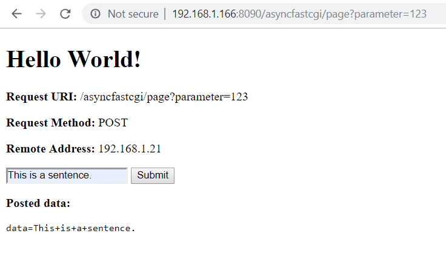

# AsyncFastCGI.NET

Fully async FastCGI client library for `.NET Core`, written in C#. A non-intrusive alternative for developing web applications.

All parts are implemented from the FastCGI specification, which are used by `Nginx`. Please refer to the end of this document
for an example NginX configuration. The performance is stable at high loads when using the KeepAlive setting in NginX for the FastCGI connections.

## Example

Your request handler method is called after the parameters (they include the HTTP headers) are processed, but before the request payload is read.

```csharp
class Program
{
    static async Task Main(string[] args)
    {
        var client = new AsyncFastCGI.Client();

        client.setPort(9090);
        client.setBindAddress("0.0.0.0");       // Bind to all interfaces
        client.setMaxConcurrentRequests(256);   // When reached then queued
        client.setConnectionTimeout(10000);     // 10 seconds
        client.SetMaxHeaderSize(16384);         // 16 KB. Max HTTP header length
        client.requestHandler = Program.requestHandler;
        
        await client.startAsync();
    }

    /// <summary>
    /// Here comes your code to handle requests.
    /// </summary>
    private static async Task RequestHandler(AsyncFastCGI.Input input, AsyncFastCGI.Output output) {
        output.SetHttpStatus(200);
        output.SetHeader("Content-Type", "text/html; charset=utf-8");

        string requestURI = input.GetParameter("REQUEST_URI");
        string requestMethod = input.GetParameter("REQUEST_METHOD");
        string remoteAddress = input.GetParameter("REMOTE_ADDR");
        string requestData = WebUtility.HtmlEncode(await input.GetContentAsync());

        await output.WriteAsync($@"<!DOCTYPE html>
<html>
    <body>
        <h1>Hello World!</h1>
        
        <p><b>Request URI:</b> {requestURI}</p>
        <p><b>Request Method:</b> {requestMethod}</p>
        <p><b>Remote Address:</b> {remoteAddress}</p>
        <p>
            <form method='post'>
                <input type='text' name='data' length='60'>
                <input type='submit' value='Submit'>
            </form>
        </p>
        <p><b>Posted data:</b></p>
        <pre>{requestData}</pre>
    </body>
</html>
");

        await output.EndAsync();
    }
}
```

The output is the following:



## Benchmark results

The benchmarking is done in another project. For more information see [FastCGI-bench](https://github.com/bolner/FastCGI-bench). The following result sample is a high concurrency comparison between a NodeJS client, this library, and a [non-async library](https://github.com/LukasBoersma/FastCGI), written in C#.

It must be noted that all FastCGI clients require a warm-up with lower concurrencies before going to 400, otherwise the first X connections fail.

### KeepAlive = On / Concurrency = 400

Although the short-term performance is worse using the KeepAlive setting in NginX, still this is the only sustainable way for any FastCGI library.
The reason can be seen while running the ApacheBench test for like 5 minutes. When KeepAlive is disabled, then NginX creates a
new TCP connection to the client for each of its incoming connections. The count of used ports soon reaches the maximum 65535,
because even when the connections complete, their sockets stay for a while in the `TIME_WAIT` state. Thefore the most important use case is when KeepAlive=On, so the ports are not exhausted:

    ab -kc 400 -n 200000 127.0.0.1/PATH

NginX settings:

    fastcgi_keep_conn on;
    fastcgi_request_buffering off;
    keepalive 400;

The `node-fastcgi` library doesn't support the KeepAlive setting. It immediately closes the TCP connections to NginX after the requests complete.

| Library          | Req. /sec  | Req. Time  | Conc. R.T. | Longest R. | Failed     |
|------------------|------------|------------|------------|------------|------------|
| AsyncFastCGI.NET | 9111.87    | 43.899 ms  | 0.110 ms   | 92 ms      | 0          |
| node-fastcgi     | no support | no support | no support | no support | no support |
| LB FastCGI       | fails      | fails      | fails      | fails      | fails      |

*Req. Time: mean | Conc. R.T.: mean, across all concurrent requests*

### KeepAlive = Off / Concurrency = 400

As mentioned in the previous point, it is not recommended to turn KeepAlive off in NginX.
The only reason this option is shown is that the NodeJS library works and the results are comparable.

    ab -kc 400 -n 200000 127.0.0.1/PATH

NginX settings:

    fastcgi_keep_conn off;
    fastcgi_request_buffering off;

| Library          | Req. /sec | Req. Time | Conc. R.T. | Longest R. | Failed |
|------------------|-----------|-----------|------------|------------|--------|
| AsyncFastCGI.NET | 19893.88  | 20.107 ms | 0.050 ms   | 2044 ms    | 0      |
| node-fastcgi     | 21411.16  | 18.682 ms | 0.047 ms   | 1062 ms    | 0      |
| LB FastCGI       | fails     | fails     | fails      | fails      | fails  |

*Req. Time: mean | Conc. R.T.: mean, across all concurrent requests*
*The maximum concurrency the `LB FastCGI` library can handle was around 50-60.*

## Build and run

1. Install `.NET Core` on Ubuntu 18.04

    Execute the following as root:

    ```bash
    wget -q https://packages.microsoft.com/config/ubuntu/18.04/packages-microsoft-prod.deb
    dpkg -i packages-microsoft-prod.deb

    add-apt-repository universe
    apt-get install apt-transport-https
    apt-get update
    apt-get install dotnet-sdk-2.2
    ```

2. Build or run for debug and development

    ```bash
    dotnet build
    dotnet run 8080
    ```

3. Release build

    For Ubuntu and Windows:

    ```bash
    dotnet publish -c Release -r ubuntu.18.04-x64

    dotnet publish -c Release -r win10-x64
    ```

### Nginx config

The performance is worse when using the `least_conn` load balancing mode.

        upstream fastcgi_backend_csharp {
                keepalive 400;

                server 127.0.0.1:9090;
                server 127.0.0.1:9091;
                server 127.0.0.1:9092;
                server 127.0.0.1:9093;
        }

        server {
                listen 80 default_server;
                listen [::]:80 default_server;

                root /var/www/html;
                server_name _;

                fastcgi_keep_conn on;
                fastcgi_request_buffering off;

                location / {
                        try_files $uri $uri/ =404;
                }

                location /asyncfastcgi {
                        include /etc/nginx/fastcgi_params;
                        fastcgi_pass fastcgi_backend_csharp;
                }
        }
